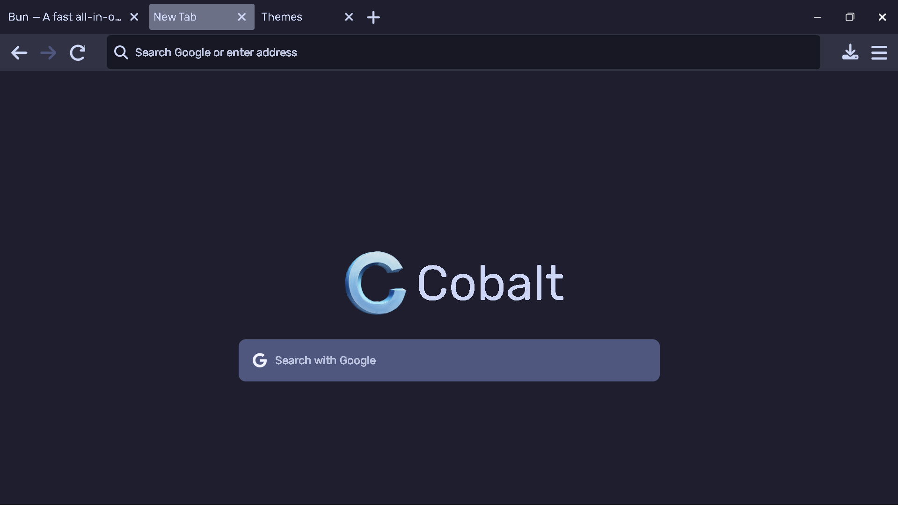
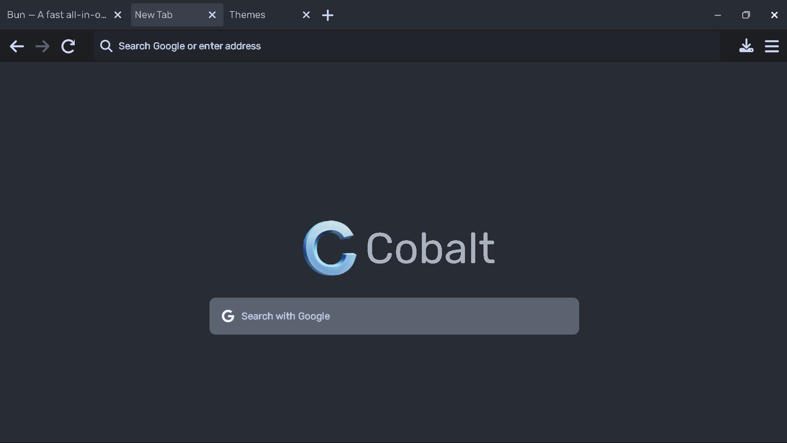
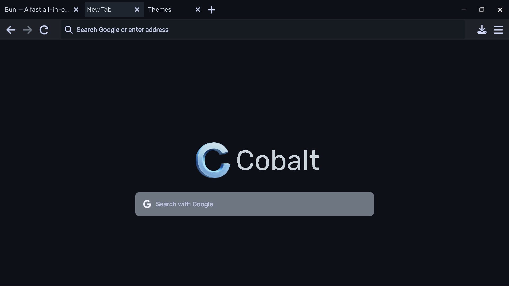
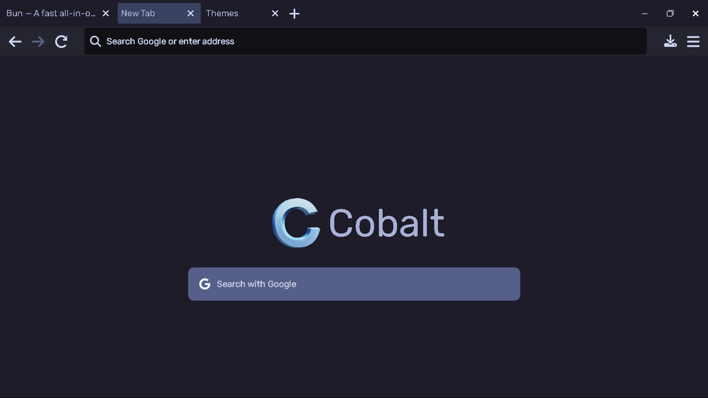

# Cobalt

An Electron-based browser made with React and TypeScript

# Themes

## Features

-   Basic Navigation
-   History Management
-   Download Management
-   Custom Themes
-   Adblock Comes By Default

## Shortcuts

-   Ctrl + Y &rarr; Themes
-   Ctrl + H &rarr; History
-   Ctrl + J &rarr; Downloads
-   Ctrl + F &rarr; Find
-   Ctrl + T &rarr; Open new tab
-   Ctrl + Shift + T &rarr; Open previously closed tab
-   Ctrl + W &rarr; Close tab
-   Ctrl + 1...9 &rarr; Go to corresponding tab
-   Ctrl + + &rarr; Zoom in
-   Ctrl + - &rarr; Zoom out
-   Ctrl + 0 &rarr; Reset Zoom
-   Ctrl + Shift + I &rarr; Open devtools

## Themes

### Catppuccin

### One Dark Pro

### Github Dark

### Tokyo Night

